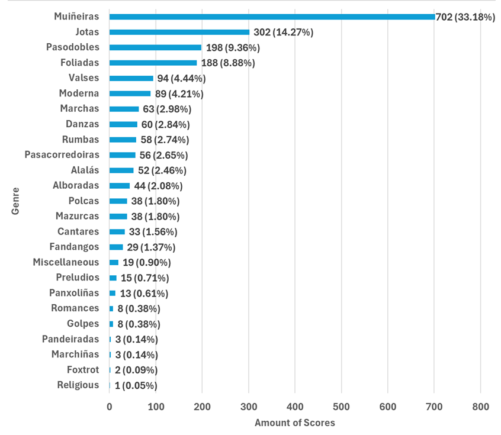
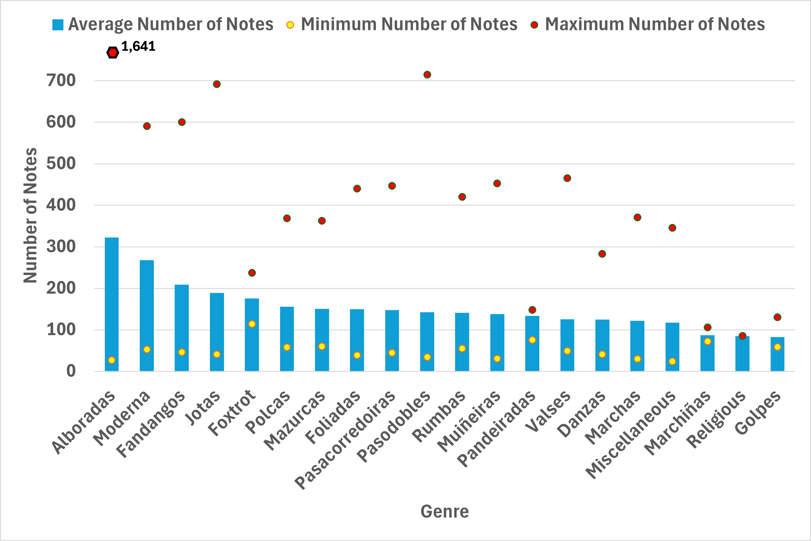
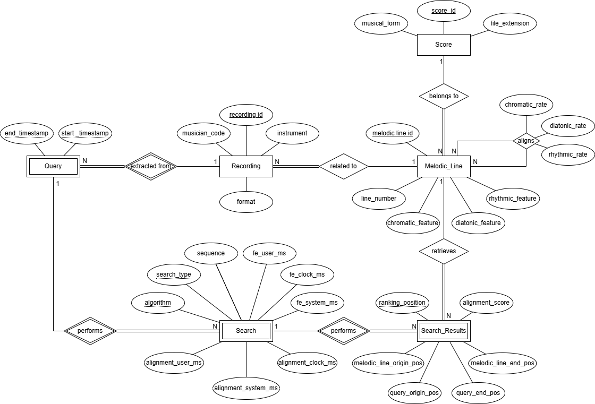
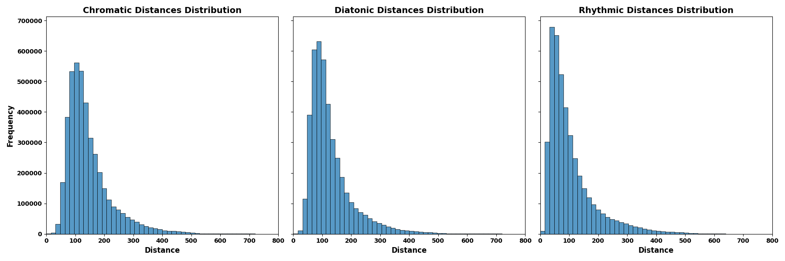
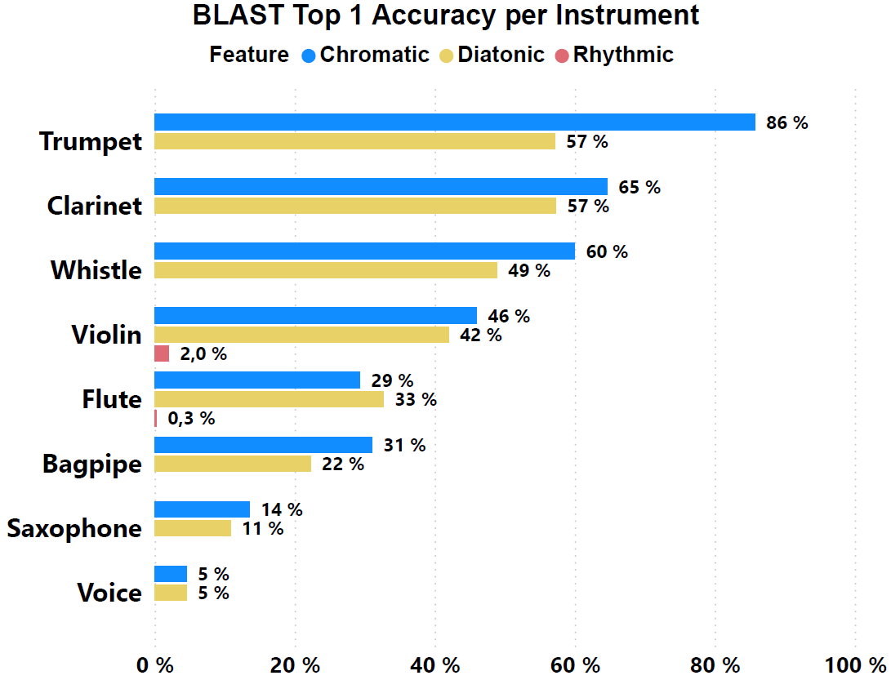
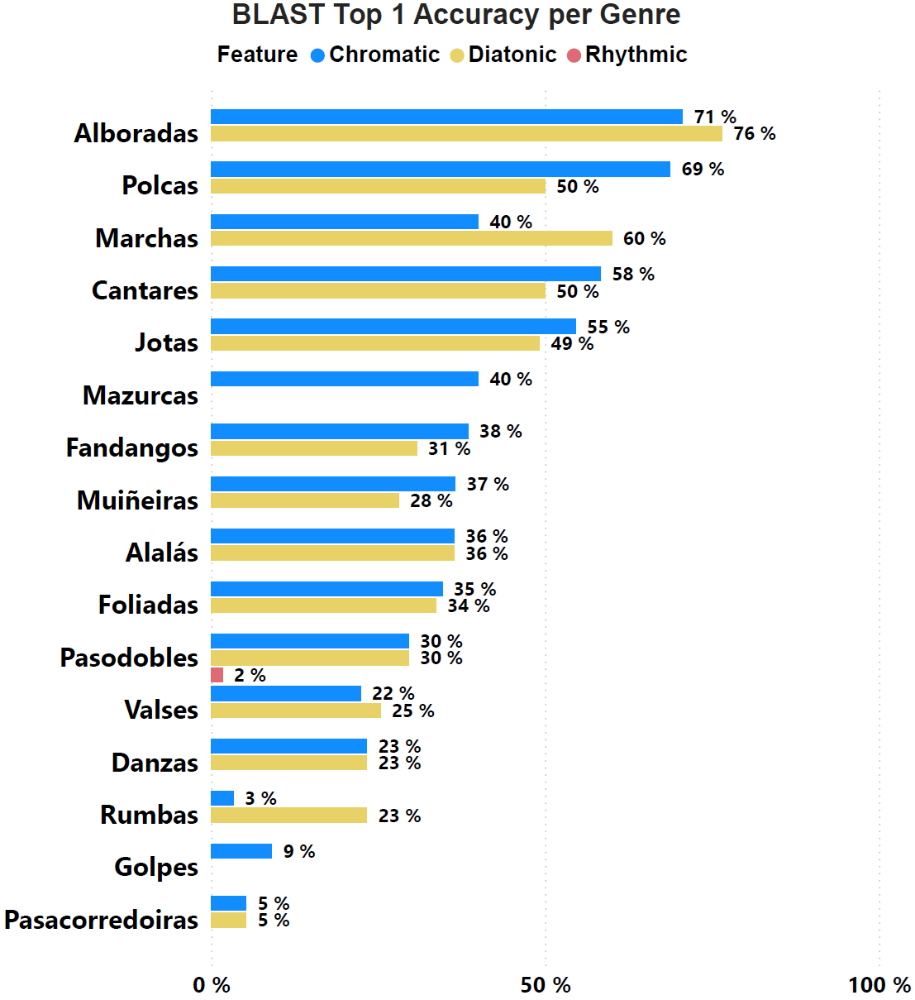
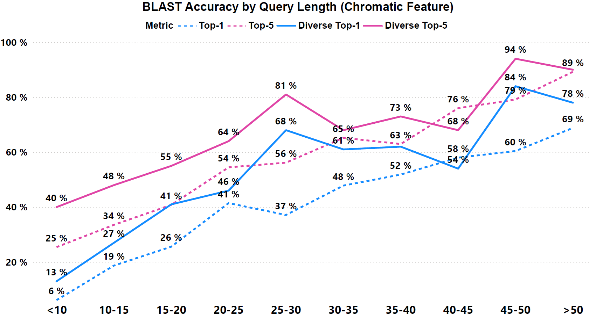

# **FUGA-ID** & **Folkoteca Galega Dataset**

**FUGA-ID** (Folk mUsic Genome Alignment for IDentification) is a system designed to retrieve symbolic representations of folk melodies by playing an instrument or humming. The system uses sequence alignment techniques inspired by genomics to identify musical pieces from partial or varied interpretations.

This repository contains both the FUGA-ID system and the Folkoteca Galega dataset, a collection of traditional Galician folk music in symbolic format.

## Table of Contents

- [**FUGA-ID** \& **Folkoteca Galega Dataset**](#fuga-id--folkoteca-galega-dataset)
  - [Table of Contents](#table-of-contents)
  - [System Overview](#system-overview)
    - [Key Features](#key-features)
      - [Scores Processing](#scores-processing)
      - [Query Processing](#query-processing)
    - [Code Distribution](#code-distribution)
  - [Folkoteca Galega Dataset](#folkoteca-galega-dataset)
    - [Dataset Statistics](#dataset-statistics)
    - [Recordings](#recordings)
  - [Download and Setup](#download-and-setup)
    - [Requirements](#requirements)
    - [Setup](#setup)
  - [Running Tests](#running-tests)
    - [Results Database](#results-database)
  - [System Evaluation](#system-evaluation)
    - [Dataset Similarity Analysis](#dataset-similarity-analysis)
    - [Performance Metrics](#performance-metrics)
      - [General Recordings Test Set](#general-recordings-test-set)
      - [Piano Recordings Test Set](#piano-recordings-test-set)
      - [Scalability Analysis](#scalability-analysis)
  - [Glossary](#glossary)
  - [How to Cite This Work](#how-to-cite-this-work)


## System Overview

This image displays the system schema. The upper part, coloured yellow, represents the functionalities at [*scores* folder](fuga-id/scores/). The middle part, coloured green, indicates the shared code [*common* folder](fuga-id/common/). The lower part, coloured blue, is related to query and alignment processing at [*queries* folder](fuga-id/queries/).  

![The figure illustrates the system's functionality, starting with the processing of scores and queries to obtain their respective features in the required format for alignment algorithms. The right-hand side of the image is delineated to show where the alignment algorithms are executed to obtain the top five search results. The mid-section of the image provides a visual overview of the dynamic generation of dictionaries during the analysis of the Folkoteca Galega dataset and their subsequent usage during query processing.](assets/system.png)

### Key Features
#### Scores Processing
- Converts MusicXML scores to **kern format and extracts their melodic lines.
- Computes the chromatic intervals, diatonic intervals and rhythm ratios from each melodic line.
- Prepares the extracted features for both alignment algorithms:
  - Creates feature text files and cost maps for the fitting alignment algorithm
  - Builds searchable indexes for the BLAST algorithm

#### Query Processing
- Accepts WAV or MIDI files as input for searching.
- Extracts the features from the query file.
- Performs approximate alignment using either the fitting alignment algorithm or the [BLAST](https://blast.ncbi.nlm.nih.gov/Blast.cgi) algorithm.
- Returns the top 5 best-matching music scores.

### Code Distribution
The code is organized into the following directories:
- *analysis* : Contains implementations of the global alignment algorithm to evaluate similarity between pieces in the dataset.
- *common* : Stores code shared between different system modules.
- *database* : Includes everything related to building and analyzing the database generated during tests.
- *queries* : Contains scripts and data to process queries and perform alignments against the features extracted from the scores.
- *scores* : Groups code and data needed to extract features from scores and prepare them for both alignment algorithms.


## Folkoteca Galega Dataset
The Folkoteca Galega dataset consists of 2,116 traditional folk music pieces from Galicia (northwest Spain), provided in MusicXML format. These pieces are categorized into 25 distinct genres. You can find them at [*Scores MusicXML*](fuga-id/scores/data/origin/scores_musicxml/) folder.

### Dataset Statistics


Figure 1. Number of scores per genre.


Figure 2. Average number of notes per score by genre.


### Recordings
Two sets of audio recordings are available for testing:

- [General Recordings](fuga-id/queries/data/folkoteca_audios/):
Contains 156 WAV files recorded by 10 different musicians using 8 instruments.

- [Piano Recordings](fuga-id/queries/data/folkoteca_piano_recordings/):
A collection of 50 piano performances, available in both WAV and MIDI formats (totaling 100 files).

| Instrument | Number of Recordings |
| ---------- | :------------------: |
| Bagpipes   |          47          |
| Clarinet   |          13          |
| Flute      |          50          |
| Piano      |          50          |
| Saxophone  |          6           |
| Trumpet    |          3           |
| Violin     |          11          |
| Voice      |          5           |
| Whistle    |          21          |


## Download and Setup

### Requirements
- [Git](https://git-scm.com/)
- [Docker](https://www.docker.com/)

### Setup
1. Clone the source repository: 
   ```bash
   git clone https://github.com/hromerovelo/fuga-id.git
   ```
2. Generate the Docker image:
   ```bash
   cd fuga-id
   ```
   ```bash
   docker build -t fuga-id:1.0 . 
   ```
3. Create and run the docker container: 
   ```bash
   docker run -d -p 2222:22 --name fuga-id_container fuga-id:1.0
   ```
4. Connect via SSH to the running container using the default credentials (*user*/*user*):
   ```bash
   ssh user@localhost -p 2222
   ```
5. Navigate to the *fuga-id* folder:
   ```bash
   cd fuga-id
   ```

## Running Tests

Before running a new general test, it is necessary to run the following command to delete all previously computed data:
```bash
bash clean_run.sh
```

To perform a general test with queries extracted from the set of 156 recordings, please execute:
```bash
bash run_fuga-id.sh
```

You can also select the piano set of recordings by adding a flag *-p*:
```bash
bash run_fuga-id.sh -p
```

Results will be available at *folkoteca.db* in the [database](fuga-id/database/) folder, along with an XLSX file with the performance and ranking metrics obtained. You can access the *folkoteca.db* and run any SQL query executing: 
```bash
cd database
sqlite3 folkoteca.db
```

### Results Database

When a general test is conducted, the system generates a database with the obtained results. This database stores detailed information about processed queries, retrieved scores, and system performance metrics.

The following entity-relationship (ER) diagram shows the database structure:



The database allows subsequent analysis of system performance, such as:
- Success rates by musical genre
- Effectiveness according to the instrument used in the query
- Impact of query length on result accuracy

## System Evaluation

### Dataset Similarity Analysis
To assess the internal similarity of the Folkoteca Galega dataset, we computed pairwise global alignment scores between all melodic lines for each feature type. This analysis helps to understand the distinctiveness of pieces within the corpus.


*Figure 6: Distribution of alignment distances between scores across different feature types*

To run this analysis yourself, execute the following within the *analysis* folder:

```bash
python3 compute_corpus_global_alignment.py
```

You can find a summary of the similarity analysis at [*benchmark*](benchmark/) folder.


### Performance Metrics

The FUGA-ID system has been extensively evaluated using multiple test sets:

#### General Recordings Test Set
Using 156 recordings (987 queries) from 10 musicians and 8 different instruments:
- **Top-5 accuracy: 63%** for chromatic feature with BLAST algorithm
- **84% Top-1 accuracy** for longer queries (>15-20 seconds)
- **94% Top-5 accuracy** for longer queries (>15-20 seconds)
- BLAST algorithm is approximately 10 times faster than fitting alignment (average 320ms vs 3,200ms per query)
- Pitch features (chromatic and diatonic) significantly outperform rhythmic features

Performance varies by several factors:


*Figure 7: Impact of instrument type on top-1 retrieval accuracy, showing decreased hit rates for instruments with less accurate tuning*


*Figure 8: Retrieval accuracy by musical genre, with Alboradas and Marchas showing higher recognition rates due to their distinctive melodic characteristics*


*Figure 9: Effect of query length on retrieval accuracy, showing significant improvement with longer queries (>15-20 seconds)*

The results database generated after running these tests is available at [benchmark/folkoteca.db](benchmark/).

#### Piano Recordings Test Set
Using 50 piano performances (over 300 queries):
- Direct MIDI input significantly outperforms WAV audio conversion
- For rhythmic feature with fitting alignment:
  - MIDI: Top-5 accuracy of 14.75%, MRR of 0.104
  - WAV: Top-5 accuracy of 0.60%, MRR of 0.006
- For rhythmic feature with BLAST:
  - MIDI: Top-5 accuracy of 5.26%, MRR of 0.039
  - WAV: Top-5 accuracy of 1.20%, MRR of 0.005

#### Scalability Analysis
The system's scalability was evaluated using progressively larger subsets of the dataset:
- BLAST maintains efficient performance as database size increases
- Fitting alignment shows linear growth in query time

Detailed performance metrics and analysis can be found in the [benchmark](benchmark/) folder.

## Glossary

The table below provides a list of terms used in this repository to facilitate understanding.
| Term           | Definition                                                                                                                 |
| -------------- | -------------------------------------------------------------------------------------------------------------------------- |
| *chromatic*    | Refers to the distance in semitones between one note and the following.                                                    |
| *diatonic*     | Refers to the interval number between one note and the following.                                                          |
| *feature*      | Characteristic retrieved from a musical piece. We consider two pitch features (chromatic and diatonic) and a rhythmic one. |
| *musical form* | Genre of the musical composition.                                                                                          |
| *rhythm*       | The rhythm feature is computed as the ratio of duration between one note and the preceding.                                |
| *search type*  | Feature selected to undertake the alignment.                                                                               |


## How to Cite This Work

If you use FUGA-ID or the Folkoteca Galega dataset in your research, please cite:

```bibtex
@article{romero2025fuga,
  title={FUGA-ID: A Bioinformatics-Based Approach to Symbolic Folk Melody Identification},
  author={Romero-Velo, Hilda and Bernardes, Gilberto and Ladra, Susana and Paramá, José R. and Silva-Coira, Fernando},
  journal={},
  volume={},
  number={},
  pages={},
  year={},
  publisher={}
}